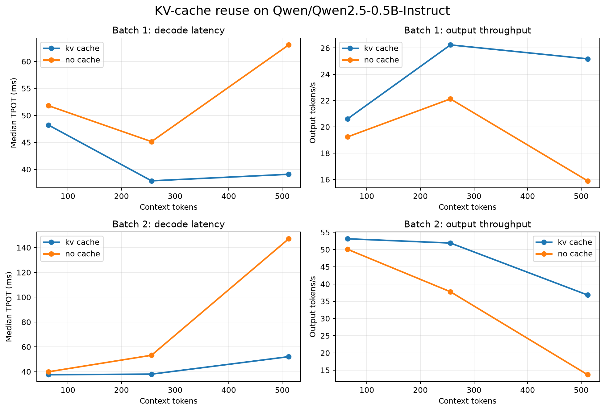
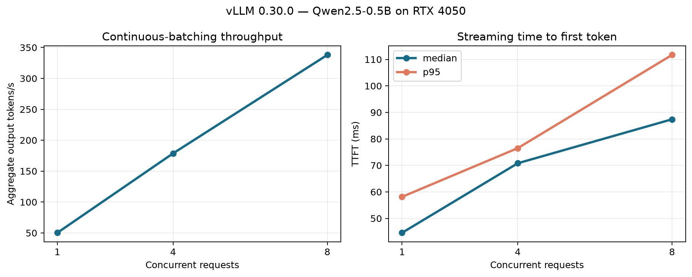
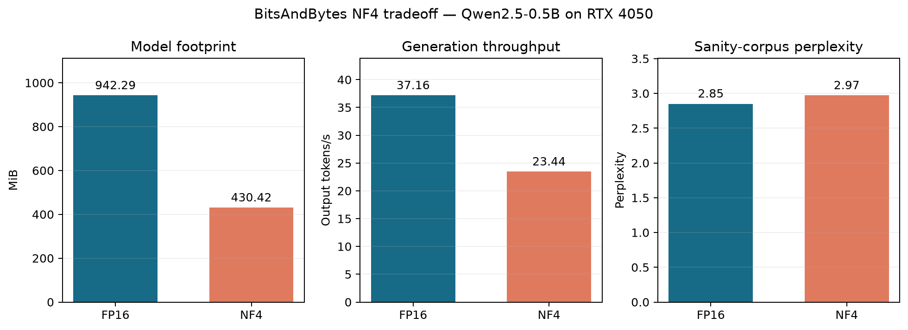

# Real-Time LLM Inference Optimization Lab

A measurement-first study of language-model inference latency, throughput, memory, and KV-cache behavior on constrained hardware.

This repository is built around a simple rule: **profile the complete path before claiming an optimization**. It retains raw runs, reports median and p95 latency, validates kernels against reference implementations, and keeps measured evidence separate from planned experiments.



## Measured results

All measurements below used Qwen2.5-0.5B-Instruct on an NVIDIA RTX 4050 Laptop GPU with 6 GB VRAM. Tokenization is excluded from the local model benchmark and included in the HTTP serving measurements.

### KV-cache reuse

At a 512-token context and batch size 2, reusing the autoregressive KV cache produced:

| Metric | Full recomputation | KV-cache reuse | Change |
|---|---:|---:|---:|
| Median decode TPOT | 147.09 ms | 52.07 ms | **64.6% lower** |
| Output throughput | 13.68 tokens/s | 36.81 tokens/s | **169% higher** |
| p95 end-to-end latency | 5,162.24 ms | 2,125.62 ms | **58.8% lower** |
| Peak allocated memory | 1,590.0 MiB | 1,279.7 MiB | **19.5% lower** |

The benefit is workload-dependent: at 64 tokens and batch size 1, cache reuse improved throughput by only 7.1%. The gap becomes material as context length and batch size grow.

### vLLM continuous batching

The OpenAI-compatible vLLM 0.30.0 server used FlashAttention, prefix caching, FP16 weights, a 1,024-token maximum sequence length, and eager execution. Each request generated 64 tokens from a shared prompt after two warm-up requests.

| Concurrency | Median TTFT | p95 TTFT | Aggregate throughput |
|---:|---:|---:|---:|
| 1 | 44.57 ms | 58.14 ms | 50.24 tokens/s |
| 4 | 70.81 ms | 76.51 ms | 178.71 tokens/s |
| 8 | 87.40 ms | 111.69 ms | 338.03 tokens/s |

Throughput scaled **6.73×** from concurrency 1 to 8 while median TTFT remained below 88 ms.



### Fused Triton RMSNorm

The custom FP16 Triton kernel was checked against a PyTorch reference before timing. Across 100 post-warm-up repetitions it achieved **2.83–6.06× median speedup**, depending on tensor shape, with maximum absolute error of **0.0078125**.

| Shape | PyTorch median | Triton median | Speedup |
|---|---:|---:|---:|
| 1,024 × 896 | 0.1275 ms | 0.0451 ms | 2.83× |
| 4,096 × 896 | 0.3348 ms | 0.0604 ms | 5.54× |
| 1,024 × 3,584 | 0.3599 ms | 0.0594 ms | 6.06× |

### NF4 weight quantization

BitsAndBytes NF4 with double quantization reduced the model footprint by **54.3%**, from 942.3 MiB to 430.4 MiB. It was not a speedup on this workload: generation throughput fell 36.9%, and perplexity increased 4.2% on a fixed 512-token engineering-text sanity corpus.

| Mode | Model footprint | Output throughput | Sanity-corpus perplexity |
|---|---:|---:|---:|
| FP16 | 942.3 MiB | 37.16 tokens/s | 2.851 |
| NF4 | 430.4 MiB | 23.44 tokens/s | 2.971 |

The result is intentionally retained as a negative optimization finding: compressing weights relieved capacity pressure but introduced dequantization overhead that dominated this small-model, batch-1 workload.



## What is implemented

- Deterministic PyTorch/Transformers prefill and autoregressive decode benchmark
- Controlled KV-cache reuse vs full-recomputation comparison
- TTFT, TPOT, end-to-end latency, output throughput, and peak-memory measurement
- Context-length and batch-size experiment matrix
- Theoretical grouped-query-attention KV-cache capacity analysis
- OpenAI-compatible streaming load generator for vLLM and SGLang servers
- Triton RMSNorm kernel with a tested PyTorch reference and safe fallback
- FP16 vs BitsAndBytes NF4 memory, speed, and fixed-corpus quality comparison
- Machine-readable JSON reports, plotting, unit tests, and CI

## Reproduce the local benchmark

```bash
python -m venv .venv
source .venv/bin/activate
pip install -e ".[dev,serving]"
python scripts/run_transformers_benchmark.py
python scripts/analyze_kv_cache.py
python scripts/plot_results.py
python scripts/benchmark_quantization.py
python scripts/plot_quantization.py
pytest
```

Windows PowerShell activation is `.venv\Scripts\Activate.ps1`. CUDA execution requires a CUDA-enabled PyTorch build.

## Benchmark a vLLM or SGLang server

Start an OpenAI-compatible server in a supported Linux environment. For example:

```bash
pip install vllm==0.30.0
vllm serve Qwen/Qwen2.5-0.5B-Instruct --dtype half --max-model-len 4096
python scripts/benchmark_openai_server.py \
  --model Qwen/Qwen2.5-0.5B-Instruct \
  --concurrency 4 --requests 32 --max-tokens 64
```

The load generator uses streaming responses to measure TTFT rather than treating the entire response as one opaque request.

The exact measured commands and interpretation are documented in [the benchmark report](docs/benchmark_report.md).

## Evidence

Measured results and figures live under `results/` and `assets/`. See [the experiment design](docs/experiment_design.md) for timing boundaries, controlled variables, and limitations.

## Repository map

```text
configs/                 benchmark matrices
src/inference_lab/       metrics, KV-cache analysis, kernels, benchmark engine
scripts/                 runnable experiments and plotting
tests/                   correctness and invariant tests
docs/                    methodology and resume evidence
results/                 machine-readable measured outputs
assets/                  generated figures
```

## Scope

This is an engineering benchmark, not a claim of production-scale serving. Laptop measurements are labeled with their exact hardware and runtime. vLLM/SGLang results are only reported after running the separate server harness on a supported Linux system.
